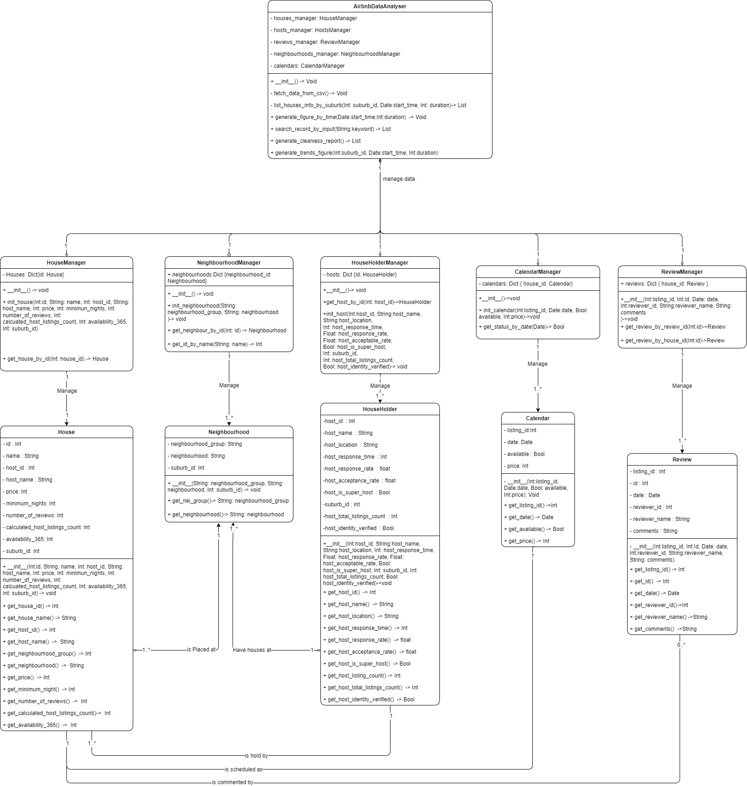

# 2810ICT/7810ICT 2023 Assignment - Group47
---
**Team Member**

| First_Name | Last_Name | Student_Number |
|------------|-----------|----------------|
| Siqi       | Wu        | s5312984       |
| Zhanrui    | Liao      | s5290972       |
| Chien      | Huang     | s5333270       |
---
**Project Management Board**

For this assignment, we chose Trello as our project management tools.  
- [Head to our trello board](https://trello.com/b/K5lAmD8X/software-technology-group47)

---

## Work Flow Chart

## UML

---
* class House  
    * Attributes  
        \- id  
        \- name  
        \- host_id  
        \- host_name  
        \- price  
        \- minimum_nights  
        \- number_of_reviews  
        \- calculated_host_listings_count  
        \- availability_365  
        \- suburb_id

    * Functions  
        \- __init__()  
        \+ get_house_id()  
        \+ get_house_name()  
        \+ get_host_id()  
        \+ get_host_name()  
        \+ get_neighbourhood_group()  
        \+ get_neighbourhood()  
        \+ get_price()  
        \+ get_minimum_night()  
        \+ get_number_of_reviews()  
        \+ get_calculated_host_listings_count()  
        \+ get_availability_365()  

* class HouseHolder  
    * Attributes  
        \- host_id  
        \- host_name  
        \- host_location  
        \- host_response_time  
        \- host_response_rate  
        \- host_acceptance_rate  
        \- host_is_super_host  
        \- suburb_id
        \- host_total_listings_count  
        \- host_identity_verified  

    * Functions  
        \- __init__()  
        \+ get_host_id()  
        \+ get_host_name()  
        \+ get_host_location()  
        \+ get_host_response_time()  
        \+ get_host_response_rate()  
        \+ get_host_acceptance_rate()  
        \+ get_host_is_super_host()  
        \+ get_host_listing_count()  
        \+ get_host_total_listings_count()  
        \+ get_host_identity_verified()  

* class Review
    * Attributes  
        \- listing_id  
        \- id  
        \- date  
        \- reviewer_id  
        \- reviewer_name  
        \- comments  
    

    * Functions  
        \- __init__()  
        \+ get_listing_id()  
        \+ get_id()  
        \+ get_date()  
        \+ get_reviewer_id()  
        \+ get_reviewer_name()  
        \+ get_comments()  

* class Neighbourhood  
    * Attributes  
        \- neighbourhood_group  
        \- neighbourhood  
        \- suburb_id
    

    * Functions  
        \- __init__()  
        \+ get_neighbourhood_by_id()

* class Calender  
    * Attributes  
        \- listing_id  
        \- date  
        \- available  
        \- price  
    
    * Functions  
        \- __init__()  
        \+ get_listing_id  
        \+ get_date  
        \+ get_available  
        \+ get_price  

* class AirbnbDataAnalyser  
    * Attributes  
        \- houses:[]  
        \- hosts:[]  
        \- reviews:[]  
        \- neighbourhoods:[]  
        \- calendars:[]  
    
    * Functions  
        \- __init__()  
        \+ fetch_data_from_csv()  
        \+ list_houses_info_by_suburb(suburb_id, start_time, duration)  
        \+ generate_figure_by_time(start_time,duration)  
        \+ search_record_by_input(keyword)  
        \+ generate_cleaniess_report()  
        \+ generate_trends_figure(suburb_id, start_time, duration)  

## Dataset Analysis

| File Name  |   Header  |     Meaning    |
|------------|-----------|----------------|
| calendar_dec18.csv | listing_id | Unique id for a housing resource |
| |  date | Date for availibility of a housing resource |
| | available | Availability for a housing resource |
| | price | The price for that housing resources on a specific date |
| listing_dec18.csv | id | Unique identifier of the housing resource |
| | listing_url | URL of the housing resource |
| | scrape_id | Unique identifier of the scrape |
| | last_scraped | Date when the data was last scraped |
| | name | Name of the housing resource |
| | summary | Summary of the housing resource |
| | space | Description of the space of the housing resource |
| | description | Detailed description of the housing resource | 
| | experiences_offered | Experiences offered by the housing resource |
| | neighborhood_overview | Overview of the neighborhood where the listing is located |
| | notes | Notes from the host |
| | transit | Transit options near the listing |
| | access | Parts of the listing guests can access |
| | interaction | Interaction between host and guests |
| | house_rules | Rules of the house |
| | thumbnail_url | URL of the thumbnail of the listing's picture |
| | medium_url | URL of the medium-sized picture of the listing |
| | picture_url | URL of the picture of the listing |
| | xl_picture_url | URL of the large picture of the listing |
| | host_id | Unique identifier of the host |
| | host_url | 	URL of the host |
| | host_name | Name of the host |
| | host_since | Date when the host registered on Airbnb |
| | host_location | Location of the host |
| | host_about | About the host |
| | host_response_time | Average response time of the host |
| | host_response_rate | Response rate of the host |
| | host_acceptance_rate | Acceptance rate of the host |
| | host_is_superhost | Whether the host is a superhost |
| | host_thumbnail_url | URL of the host's thumbnail picture |
| | host_picture_url | URL of the host's picture |
| | host_neighbourhood | Neighbourhood of the host | 
| | host_listings_count | Number of listings of the host |
| | host_total_listings_count | Total number of listings of the host |
| | host_verifications | Verifications of the host |
| | host_has_profile_pic | Whether the host has a profile picture |
| | host_identity_verified | Whether the host's identity is verified |
| | street | Street where the listing is located |
| | neighbourhood | Neighbourhood where the listing is located |
| | neighbourhood_cleansed | Cleans |
|listing_summary_dec18.csv | id | Unique identifier for each listing |
| | name | name for that house |
| | host_id | Unique identifier for each host | 
| | host_name | Name of the host |
| | neighbourhood_group | Larger region where the listing is located |
| | neighbourhood | Specific region where the listing is located |
| | latitude |Latitude of the listing's location |
| | longitude | Longitude of the listing's location |
| | room_type | Type of the listing |
| | price | Price per night for the listing |
| | minimum_nights | Minimum number of nights required for a reservation |
| | number_of_reviews | Total number of reviews received for the listing |
| | last_review | Date of the most recent review received for the listing |
| | reviews_per_month | Average number of reviews received per month for the listing |
| | calculated_host_listings_count | Total number of listings owned by the host |
| | availability_365 | Number of days the listing is available for booking throughout the year |
| neighbourhoods_dec.csv | neighbourhood_group | Larger region where the listing is located |
| |	neighbourhood | Specific region where the listing is located |
| reviews_dec18.csv | listing_id | Unique identifier for each listing |
| | id | Unique identifier for each review |
| | date | Date of the review |
| | reviewer_id | Unique identifier for each reviewer|
| | reviewer_name | Name of the reviewer |
| | comments | Content of the review |
| reviews_summary_dec.csv | listing_id | Unique identifier for each listing |
| | date | Date of the review |

<!--## Part A - Project Management, and Part B - Statistical Data Analysis and Presentation

The assignment work for this course is a group-based (max 3 people) data analysis project that is split into 2 parts – design and implementation. There are several different datasets in this repository – you will need to choose 1 that your team will work on for both Part A and B. The overall goal for this assignment is to develop a simple data analysis and visualization tool for a dataset. You will need to design and implement this tool, and it must provide a graphical user interface that will handle the analysis and visualization of the data. Each dataset has a number of analysis and visualization tasks that your interface must enable a user to perform. In addition to the listed tasks, you must come up with 1 additional analysis/visualization/insight that your software provides (you will need to come up with an appropriate task based on the dataset you pick). All the assignment work must be hosted on a GitHub repo with access restricted to your group members. This repository should have a track record of regular commits showing the incremental (and group-based) work done on the project. ALL project resources (documents, code, images, and others) should be in the GitHub repo.

Additionally, your private git repo should be shared with the following accounts:
- 2810ICT-7810ICT-Assignment
  
### Part A - Project Management (25%, Due Sunday 3rd September)

#### Submission Requirements
This assignment must be submitted online via L@G under the assessment page. Only 1 submission per group is needed. Your submission should include:
- Project Plan.docx - A project plan document. You should use the provided template.
- Software Design Document.docx - A software design document. You should use the provided template.
- Gantt chart.xlsx - A separate Gantt chart (high-resolution version). You should embed this in your project plan (as an image or other), but also provide the original file.
- git_log.txt - A copy of the Git Log
- Any other documents/supporting files you have created that you think are necessary to include at this stage
  
In Part A, you will need to prepare a project plan that includes a Project Overview, Work-Breakdown Structure, Activity Definition and estimation and a Gantt chart for displaying scheduling & time estimation. This project plan should include sensible estimates for the various tasks required for both Part A and B (including estimates on preparing the project planning documentation). As you complete various components, you should put the actual completion time/dates on your Gantt chart to track how close you were to your estimates. For the subsequent stage of the assignment, you should revise your project plan with any additional details and continue to track your work.

You will then need to prepare a Software Design Document for one of the given data sets and related questions. You should start with a System Vision Statement (this can be included in your design document). You should then produce a formal list of requirements that need to be satisfied, some use cases for your software, a listing of system components and the related software design, and an early user interface design/wireframe (to be implemented in part B). There are templates provided for these documents. Please read the template documents for more hints and guidance.

To start your project, you should clone the following repo which contains the templates. 

https://github.com/2810ICT-7810ICT-Assignment/2810ICT-7810ICT-2023-Assignment

It is important to note that submission of this assignment is a requirement for passing the course. Late submissions will be marked according to Griffith University’s assessment policy. 5% of the overall mark will be deducted for each business day late. After 5 days, no submissions will be accepted.

### Part B – Statistical Data Analysis and Presentation (35%, Due Sunday 8th October)

#### Submission Requirements
This assignment must be submitted online via L@G under the assessment page. Only 1 submission per group is needed. Your submission should include:
- All *.py files containing the data analysis program
- User Manual.docx - (No provided template) briefly explains how to use your software and shows its features, illustrating them by using informative screenshots of your software. 
- Software Testing Report.docx - containing a brief testing plan and unit tests & coverage test results. You should use the provided template.
- Executive Summary.docx - An executive summary covering a 12-month. You should use the provided template.
- Project Plan.docx - An updated project plan document (with Gantt chart embedded)
- Gantt chart.xlsx - An updated separate Gantt chart (high-resolution version)
- Software Design Document.docx - An updated software design document
- git_log.txt - A copy of the Git Log
- Any other documents/supporting files you have created that you think are necessary to include at this stage

For Part B, you will need to implement the software that you designed in Part A. Before you begin writing code, you should come up with a testing plan that will thoroughly test the various components of your system. As you begin your implementation, you can start testing these components as they are finished. You must present the results of your testing in a testing report. You should prepare a brief user manual that explains how to use your software and shows its features. Finally, you should use your software to prepare a report that analyses the data over a 12-month period and presents the results in an executive summary. Your report should present the results from all of your required features for your chosen dataset, and should contain images from your software as well as some analysis and comments about the data.

It is important to note that submission of this assignment is a requirement for passing the course. Late submissions will be marked according to Griffith University’s assessment policy. 5% of the overall mark will be deducted for each business day late. After 5 days, no submissions will be accepted.

### Group Requirements

This assignment should be completed in groups of up to 3 people who should be in the same lab/workshop. You have a three-week window (i.e., Week 1, Week 2 and Week 3) to assemble your group autonomously. If you do not do so within this timeframe, you will be assigned to a group automatically. If you are unable to work in a group or have any specific issues, you should discuss this with your campus convenor. Make sure you include the name and student number of all group members in your submitted documentation. All group members should join the same group on L@G: People -> Group (make sure this is coordinated beforehand).

### Marking

This assignment is worth 60% of your final grade. Except in extraordinary circumstances, all group members will be given the same mark, so it is important that you all contribute and work together to complete the assignment. A full rubric for each part will be made available on the course website. Please note that all submitted assignments will be analyzed by a plagiarism detector that is specifically designed for assignment submissions containing program source code. We will aim to have all assignments marked within 2 weeks of the due date.

## Datasets

There are 4 datasets available for you to do your assignment on. Each dataset has a set of required analysis functions. Remember, in addition to the listed required analysis tools, you must come up with 1 additional analysis task/tool of your own.

### Victoria State Accident DataSet
https://www.kaggle.com/gaurav896/victoria-state-accident-dataset

**Required Features:**
- For a user-selected period, display the information of all accidents that happened in the period.
- For a user-selected period, produce a chart to show the number of accidents in each hour of the day (on average).
- For a user-selected period, retrieve all accidents caused by an accident type that contains a keyword (user entered), e.g. collision, pedestrian.
- Allow the user to analyze the impact of alcohol in accidents – ie: trends over time, accident types involving alcohol, etc.
- One other ‘insight’ or analysis tool of your choice

### Sydney Airbnb Data: 
https://www.kaggle.com/tylerx/sydney-airbnb-open-data

**Required Features:**
- For a user-selected period, report the information of all listings in a specified suburb
- For a user-selected period, produce a chart to show the distribution of prices of properties
- For a user-selected period, retrieve all records that contain a keyword (user entered), e.g. pool, pet.
- Analysing how many customers commented on factors related to cleanliness (multiple key words may be associated with cleanliness – justify your selection). 
- One other ‘insight’ or analysis tool of your choice

### NSW Traffic Penalty Data: 
https://www.kaggle.com/llihan/australia-nsw-traffic-penalty-data-20112017

**Required Features:**
- For a user-selected period, report the information of all penalty cases.
- For a user-selected period, produce a chart to show the distribution of cases in each offense code
- For a user-selected period, retrieve all cases captured by radar or camera based on offense description
- Analysing the cases caused by mobile phone usage - ie: trend over time, offense code, and so on.
- One other ‘insight’ or analysis tool of your choice

### New York Restaurant Inspection results: 
https://www.kaggle.com/datasets/new-york-city/nyc-inspections

**Required Features:**
- For a user-selected period, retrieve relevant inspection details.
- For a user-selected period, plot the distribution of violations over the different suburbs
- For a user-selected period, retrieve all violations that contain a keyword (user entered).
- Analyse the cases related to animals, e.g., rats, mice or others, and their trend over time and distribution over suburbs
- One other ‘insight’ or analysis tool of your choice -->
